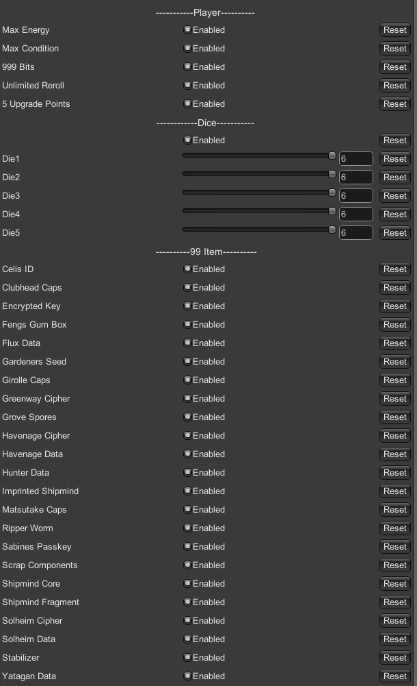

# CitizenSleeperDiceMod

A mod for the game Citizen Sleeper

## The Tragic Backstory

Back when the game first came out I got a bad ending to a character even though I tried so hard to help them.
Well, turns out it sort of stuck with me because I've thought about it every once in a while since then, and I always
felt some weird regret. So when the sequel for Citizen Sleeper was announced I was excited as hell to play it, but I
still felt like I needed to get some closure.

So I looked around for a mod or cheats so I could speedrun my way to the character story, but turns out there is not a
huge modding scene for a niche visual novel about a dying android trying to survive in the ruins of interplanetary
capitalism...

Initially this mod just let you change the die rolls (Thus the ill-fitting name), but when I decided to share it I
added some options for other things like;

- Player energy
- Player condition
- Bits
- Rerolls
- Upgrade points
- Individual die rolls
- Add 99 of any item

PS: It was the character with the yellow coat.

## How to install

### Manual

- Setup [BepInEx](https://github.com/BepInEx/BepInEx)
    - Run the game after getting it setup so it creates the folders
- Put the `com.cmyager.plugin.CS.DiceMod.dll` in `steamapps/common/Citizen Sleeper/BepInEx/plugins`
    - After starting the game the config file will be in `steamapps/common/Citizen Sleeper/BepInEx/configs`

To be able to change settings while playing you need to use [BepInEx.ConfigurationManager](https://github.com/BepInEx/BepInEx.ConfigurationManager).
So slap that in there too. `F1` to open the menu in game.

## Notes about changing settings

Setting items to 99 take effect instantly while others require you to reload the scene. This can be done multiple ways.

- Open your character screen (Suggested method)
- Sleeping
- Quit to menu
- Restart game

## Todo

- Change the name
- Make actual release/version
- put on thunderstore/R2modman or nexus mods? Nexus seems to be the only other place with Citizen Sleeper mods.

## Change Log

1.0.0 Initial Release